### <ins>**Creating a Benchmark Builder dataset tutorial**</ins>
<ul>

Before starting, ensure that the Beacons Processing Provider plugin is installed before continuing.  If it's not, then click [here](..\..\test#) to install it.

### Table of Contents ###
* [Introduction](#Introlduction)
* [Downloading the tutorial data](#downloading-the-tutorial-data)
* [Setting up the QGIS project](#setting-up-the-qgis-project)
* [Adding data](#adding-data)
* [Preparing the data](#preparing-the-data)
* [Styling the layers](#styling-the-data)
* [Create NET ORDER attributes](#create-net-order-attributes)
* [Dissolve NET ORDER streams](#dissolve-net-order-streams)
* [AGREE DEM Reconditioning](#agree-dem-reconditioning)
* [Fill Sinks](#fill-sinks)
* [Flow Direction](#flow-direction)
* [Watershed](#watershed)
* [Create NET ORDER Catchments](#create-net-order-catchments)
* [Eliminate Artifact Catchments](#eliminate-artifact-catchments)

### **Introduction**
<ul>

This tutorial has the following objectives;
* learn how to build an input file dataset for the Benchmark Builder program
* learn how to use the BEACONs processing provider plugin algorithms
* learn some basics of QGIS for new users

The Benchmark Builder dataset will be created from streams, coastline, digital elevation model (DEM) and water bodies.  NET ORDER attributes will be added to the each stream using Rupert Brook's NET scripts, which solves the order of flow to the coastline/outlet for each segment on the network.  These attributes are composed of “base 64” characters arranged in a string that are used to determine which streams are upstream or downstream on any part of the network.  Catchments will be created from a depression less, reconditioned DEM and then will be assigned the ORDER attributes of the contributing stream.  Additional attributes such as the area of water from water bodies and land will be added as well.  These attributes, along with the catchment neighbour topology will be exported as input ASCII files for the Builder program.
</ul>

### **Downloading the tutorial data**
<ul>

The tutorial data is available from [here](./data/).  This is a small drainage area located in the lower Nechako area in BC, Canada.

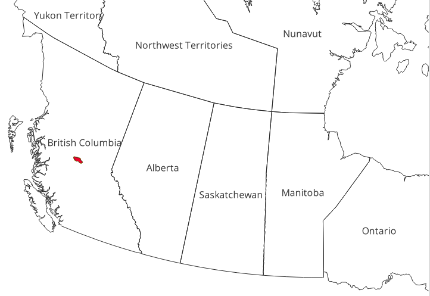

Download and unzip the geopackage called **tutorial_data.gpkg** to any directory and remember the location.
</ul>

### **Setting up the QGIS project**
<ul>

The following tasks will be performed:
1) [Create new project](#1-create-new-project)
2) [Add favorites directory](#2-add-favorites-directory)

#### **1. Create new project**
<ul>

Open QGIS and start a new project by selecting **New** from the **Project** menu.

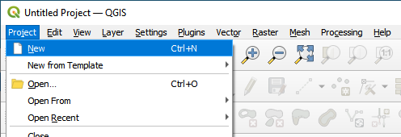

Save the project by selecting **Save** or **Save As** from the **Project** menu.  Enter a file name such **tutorial.qgz** and select any directory to save it in.  

While working through this tutorial, it is advised to save the project periodically to avoid any loss of work due to QGIS unexpectedly crashing or other unforeseen problems.
</ul>

#### **2. Add Favorites directory**
<ul>

Optionally, the project directory can be added to **Favorites** for convenient data access and management.  To do this, right mouse click on **Favorites** in the **Browser panel** and choose **Add a Directory**.

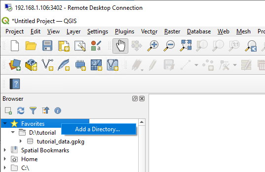

</ul>

**Video**

<video id="video" width="420" height="260" controls preload="metadata" crossorigin="anonymous">
  <source src="./videos/setting_up_the_qgis_project.mp4" type="video/mp4">
</video>

</ul>

### **Adding Data**
<ul>

The following tasks will be performed:
1) [Add data layers](#1-add-layers)
2) [Create layer groups](#2-create-layer-groups)
3) [Setting the project coordinate reference system](#3-set-project-coordinate-reference-system)

#### **1. Add layers**
<ul>

The following layers from **tutorial_data.gpkg** will be added:

|Name|Description|Type|Source|Projection|
|:--:|:--:|:--:|:--:|:--:|
|nechako_bnd|boundary|vector|nhn|EPSG 4617|
|nechako_streams|streams|vector|nhn|EPSG 4617|
|nechako_waterbodys|water bodys|vector|nhn|EPSG 4617|
|nechako_dem|dem|raster|mrdem|EPSG 3979|

Add the vector layers from **tutorial_data.gpkg** to the project by using the **Open Data Source Manager** toolbar button.  See below image labelled **1**.  

In the **Data Source Manager**, select the **Vector** tab from the left sidebar.  Then, ensure that **File** is selected in the **Source Type** section.  See below image labelled **2**.  

Next, in the **Source** section, press the Browse button **[...]** and navigate to the location of the **tutorial_data.gpkg** file and select it to populate the source **Vector dataset()s** textbox.  See below image labelled **3**.  

Then, press the **Add** button, which will open an additional dialog called **Select Items To Add**.  See below image labelled **4**.

In this dialog, press the **Select All** button to select all vector layers in tutorial_data.gpkg.  Finally, press **Add Layers** and they will appear in the **Layers panel** table of contents (TOC). See below image labelled **5** & **6**.

Note, the layers can also be added directly using the **Browser** panel by navigating to the **tutorial_data.gpkg** file using the directory tree or through **Favorites** (if added).

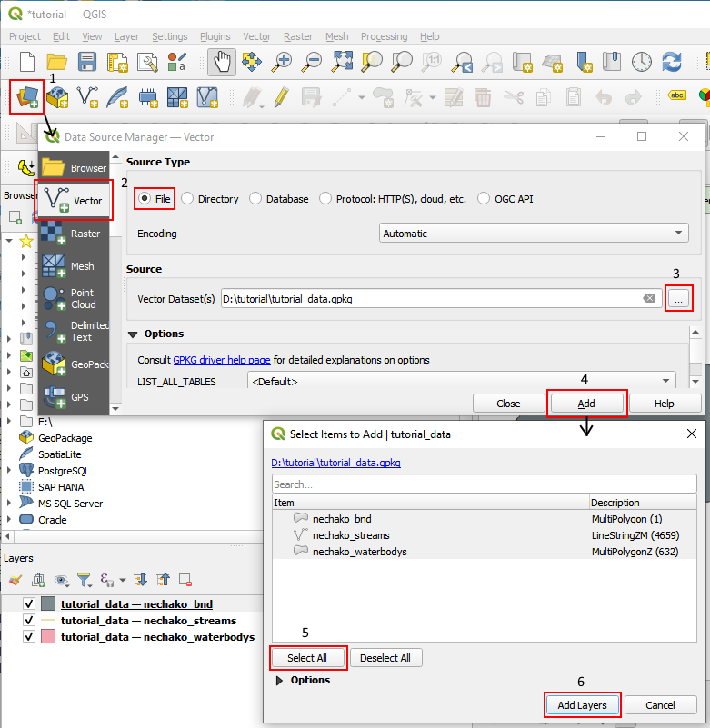

To load the raster layers, open the **Open Data Source Manager** again, but this time select the **Raster** tab from the left sidebar.  Then, ensure that **File** is selected in the **Source Type** section.  Next, in the **Source** section, press the Browse button **[...]** and navigate to the location of the **tutorial_data.gpkg** file and select it to populate the source **Raster dataset()s** textbox.  Then, press the **Add** button, which will immediately add the layer because it's the only raster in the geopackage.  The name of the added raster layer in the TOC will be "**tutorial_data**" instead of the actual name.  To rename it, right mouse click on the layer in the TOC and select **Raname Layer** from the context menu and name it **nechako_dem**.

**Video**

<video id="video" width="420" height="260" controls preload="metadata" crossorigin="anonymous">
  <source src="./videos/adding_data.mp4" type="video/mp4">
</video>

</ul>

#### **2. Create layer groups**
<ul>

Two layer groups will be created to organize the data.  One group for the original data and another for all of the output and working data.

1) Select all the layers in the Layers list and press the **Add Group** group button.  Rename **group1** to **original data** by immediately typing the new name if the edit cursor is active or by right clicking on **group1** and selecting **Rename Group** from the menu.
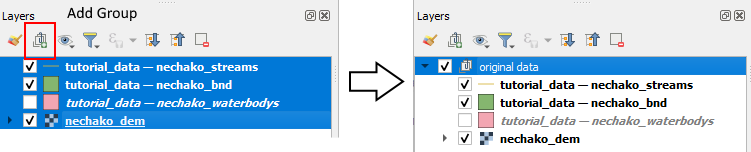

2) Right mouse click anywhere in the white area of the Layers list and select **Add Group** from the context menu.  Rename **group1** to **output** by immediately typing the new name if the edit cursor is active or by right clicking on **group1** and selecting **Rename Group** from the menu.
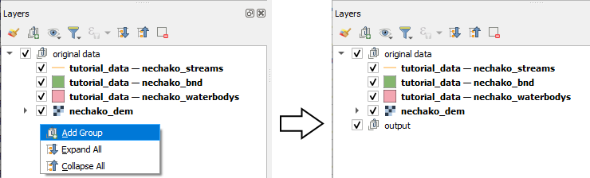

**Video**

<video id="video" width="420" height="260" controls preload="metadata" crossorigin="anonymous">
  <source src="./videos/group_layers.mp4" type="video/mp4">
</video>

</ul>

#### **3. Set project coordinate reference system**

<ul>

Set the projection of the project by selecting **Project Properties** from the **Project** menu.  In the **Project Properties** dialog, select the **CRS** tab from the left sidebar.  Then, enter **3005** into the **filter** textbox.  From the **Predefined Coordinate Reference Systems** list, select **Projected->Albers Equal Area->NAD83/BC Albers ESPG:3005** and press Apply and verify that the QGIS status bar shows **EPSG:3005** in the lower right corner.  Then press OK.
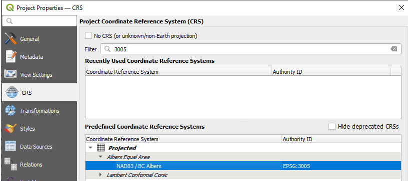

<figure>
  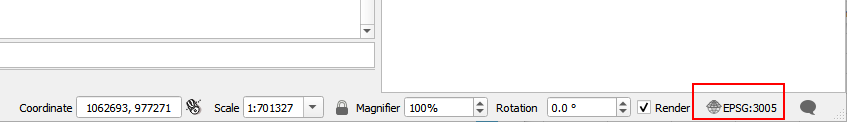
  <figcaption><i>The current projection of the project is displayed in the status bar as shown by the red highlighted area.</i></figcaption>
</figure>

**Video**

<video id="video" width="420" height="260" controls preload="metadata" crossorigin="anonymous">
  <source src="./videos/setup_project_crs.mp4" type="video/mp4">
</video>

</ul>
</ul>

</ul>

### **Preparing the Data**
<ul>

The data comes from a variety of sources with different projections, extents and properties.  The data will be made consistent by clipping all of the layers to the project boundary, reprojecting them to the same coordinate reference system, converting multipart features to singlepart and removing any Z and M geometry values.  The vector layers will be converted to rasters as well, but will not be used.  A field called NETTYPE is added to the streams layer and given a value of 1. This is the code for streams used by NET to solve the ORDER attributes.

From the Processing Toolbox, open the BEACONs->Catchment Tools->**01 Prepare Datasets** algorithm.
If the Processing Toolbox is not shown, use the **Toolbox** button  on the toolbar to make it visible.

* Select **nechako_bnd** layer for **Boundary layer**.
* Select **nechako_dem** layer  for **DEM layer**.
* Select **nechako_streams** layer  for **Streams layer**.
* Select **nechako_waterbodys** layer  for **Waterbodys layer**.
* Ensure, **Clip**, **Multipart to singleart** and **Drop Z/M values** are checked.
* Use **30**m for output cell size.
* Select **Project CRS:EPSG:3005 - NAD83/BC Albers** for **Override output coordinate system**.
* For **Output Geopackage**, select **Save to File** from the drop down and use the **Save File** dialog to enter the name of the output geopackage as **nechako.gpkg**.
* To direct the output to the **output** layer group, ensure **output** is selected in the Layers list before pressing **Run**.
<ul>

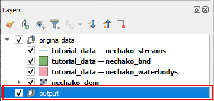
</ul>

* Press **Run**.
<ul>

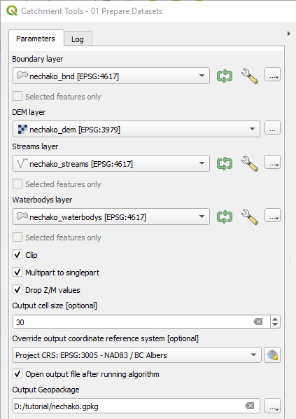
</ul>

Note, the output raster layers are saved as separate GeoTiffs files into the same directory as tutorial_data.gpkg and not into the gpkg itself.

**Video**

<video id="video" width="420" height="260" controls preload="metadata" crossorigin="anonymous">
  <source src="./videos/preparing_the_data.mp4" type="video/mp4">
</video>

To reduce the amount of vertical space occupied by the newly added raster layers to the Layers list, the symbology can be collapsed using using the **Collapse All** button. This will result in only the group items being only visible.  These can be expanded by clicking on the arrow symbol next to the group item checkbox. 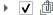.  The layers in the **original data** layer group do not need to be seen anymore and can be turned off by unchecking the group.  See below image labelled **1**.

Remove unnecessary raster layers **waterbodysr**, **streamsr** and **bndr** from the **output** group by selecting them in Layers list and then right mouse clicking on one of the selected layers and then selecting the **Remove Layer...** menu item.  See below image labelled **2**.

<figure>
  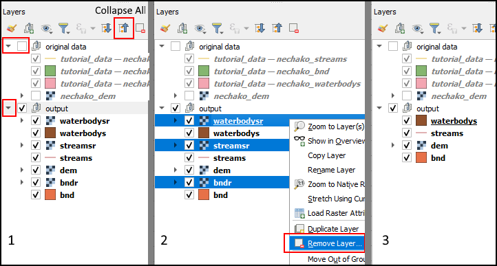
  <figcaption><i>1) Collapse layer symbology and re-expand groups. 2) Remove unnecessary layers.  3) Result </i></figcaption>
</figure>

**Video**

<video id="video" width="420" height="260" controls preload="metadata" crossorigin="anonymous">
  <source src="./videos/preparing_the_data_post.mp4" type="video/mp4">
</video>

</ul>

### <ins>**Styling The Layers**</ins>

<ul>

In this step, the symbology of the **streams**, **waterbodys** and **bnd** layer will be styled to give each a representative color.  

First, reorder the **output** group layers by dragging and dropping them within the group.   The **streams** layer should be moved to the top.

Next, double click on the **streams** layer in the Layers list.  The **Layer Properties** dialog will appear and then select **Symbology** from the left sidebar.  Next, select **Line** or **Simple Line** on the right side.  Then go down to the **Color** line and then press the down arrow button on the right.  The color picker will appear and then choose a blue color.

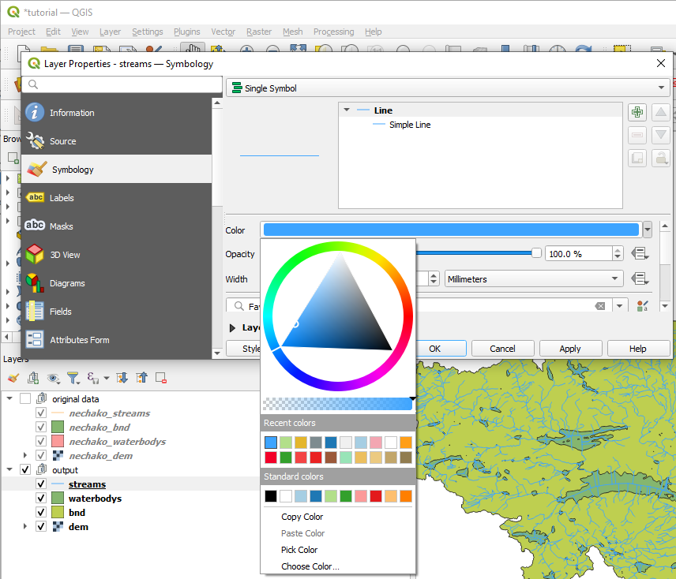

Double click on the **waterbodys** layer in the Layers list.  The **Layer Properties** dialog will appear and then select **Symbology** from the left sidebar.  Next, select **Fill** or **Simple Fill** on the right side. Then go down to the **Color** line and then press the down arrow button on the right.  The color picker will appear and then choose a blue color.

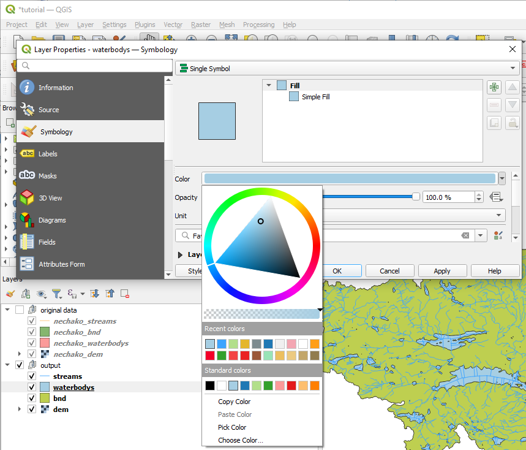

Double click on the **bnd** layer in the Layers list.  The **Layer Properties** dialog will appear and then select **Symbology** from the left sidebar.  Next, select **Simple Fill** (not Fill) on the right side. Then go down to the **Fill color** line and press the down arrow button on the right.  From the color picker, choose the **Transparent Fill** option.

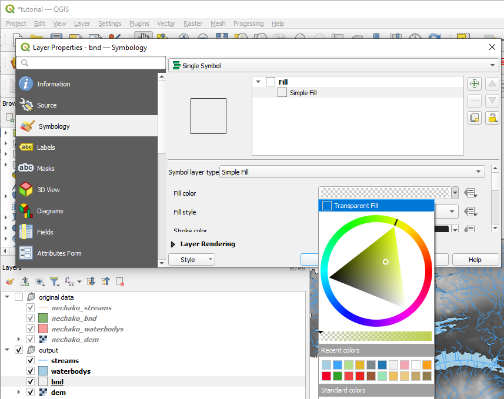

**Video**

<video id="video" width="420" height="260" controls preload="metadata" crossorigin="anonymous">
  <source src="./videos/styling_the_layers.mp4" type="video/mp4">
</video>
</ul>

### <ins>**Create NET ORDER attributes**</ins>
<ul>

This step will create the NET ORDER attributes for a stream network.  These are the attributes used to create the the input data used by the Benchmark Builder program.

The following tasks will be performed:

1) [Create coastline feature.](#1-create-coastline-feature)  
    [1a) Create new layer.](#1a-create-new-layer)  
    [1a) Setup the digitizing environment.](#1b-setup-the-digitizing-environment)  
    [1c) Add the coastline feature.](#1c-add-the-coastline-feature)
2) [Create NET ORDER attributes with the Create NET ORDER attributes algorithm.](#2-create-net-order-attributes)
3) [Check for unsolved streams](#3-check-for-unsolved-streams)  
4) [Repair unsolved streams](#4-repair-unsolved-streams)  

#### **1. Create coastline feature**
<ul>

A line feature will be created to mark the outlet or sink point on the stream network, which is used by NET to solve the NET ORDER attributes.

#### **1a) Create new layer**
<ul>
From the **Layer** menu, select **Create Layer** and then **Create new GeoPackage Layer**, which will open the **New GeoPackage Layer** dialog.  

In this dialog, from **Database**, press the Browse button **[...]** and navigate to the location of the **output.gpkg** and select it.  Press **Save**.  

In **Table Name**, enter **coastline**. For **Geometry type**, select **LineString**.  

Ensure Include Z dimension and Include M values is unchecked.  

For the CRS, choose **Project CRS: EPSG:3005 - NAD83 / BC Albers**.  

Then, in the **New Field** section,  enter **NETTYPE** for **Name** and select **Integer (32bit)** for **Type**.  Then, press **Add to Field List** and the new field will appeam the **Fields list** section.  

Press OK and a dialog will popup stating "The File already exists.  Do you want to overwrite the existing file with a new database or add a new layer to it?" Press **Add New Layer**  and the new coastline layer will appear in the TOC.

Next, the coastline feature will be added.  First, right mouse click on the coastline layer and select **Toggle Editing**.  Also, this can be done by using the **Toggle Editing** button 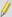 from the toolbar.  Notice the coastline layer will have a pencil symbol that indicates the layer is in edit mode.

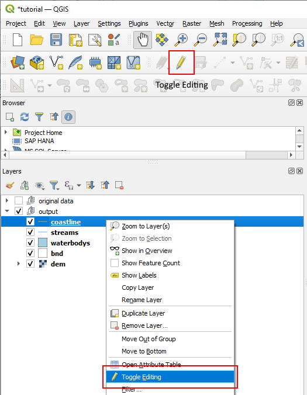

**Video**

<video id="video" width="420" height="260" controls preload="metadata" crossorigin="anonymous">
  <source src="./videos/create_coastline_layer.mp4" type="video/mp4">
</video>

</ul>

#### **1b) Setup the digitizing environment**
<ul>

Turn on the Snapping toolbar by right mouse clicking on any empty part of the toolbar area to bring up the **Panels** and **Toolbars** options.  Ensure **Snapping Toolbar** is checked in the **Toolbars** section.

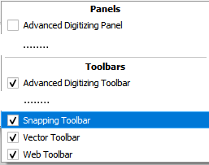

Press the **Enable Snapping** button 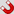 to turn on snapping.  Then press the button 
that is right next to the **Enable Snapping** button and choose 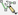 **Advanced Configuration** from the dropdown.  Then, press the **Edit advanced configuration** button 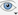 and check the **streams** layer from the list.  

**Video**

<video id="video" width="420" height="260" controls preload="metadata" crossorigin="anonymous">
  <source src="./videos/setup_the_digitizing_environment.mp4" type="video/mp4">
</video>

</ul>

#### **1c) Add the coastline feature**
<ul>

The first step is to locate the outlet, which is on far right side.  Pan and zoom until the end of the stream can be seen.  It maybe helpful to turn off all other layers except for the stream and bnd layer. 

Next, press the **Add Line Feature** toolbar button 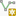 to start digitizing the coastline.  Also, ensure the **Digitize with Segment** option 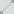 is selected.  If not, use the down arrow button 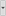 next to the **Add Line Feature** toolbar button to select it.

* Start digitizing the coastline segment by starting at the end point of the stream.  With snapping on, the cursor will snap to this point, which will be indicated by a magenta colored crosshair cursor.  See below image labelled **1**.
* Create the line segment by using the left mouse button to place points. See below image labelled **2**.
( To end digitizing, right mouse click and a dialog will appear for adding the feature attributes.  See below image labelled **3**.
* Enter 9999 for NETTYPE, which is the code for a coastline feature used by NET to solve the flow ORDER attributes.  See below image labelled **4**.

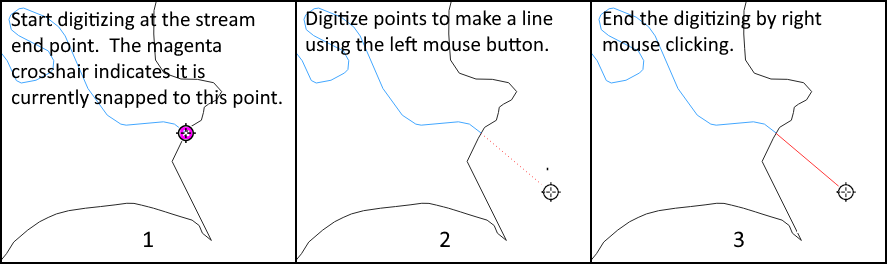

After digitizing the line, press the Toggle Editing button  and the **Stop Editing** confirmation dialog will appear.  Press the **Save** button to save the edits and to end the edit session.  The pencil icon should no longer be shown with the coastline layer in the Layers list.

This would be a good place to save the project.

**Video**

<video id="video" width="420" height="260" controls preload="metadata" crossorigin="anonymous">
  <source src="./videos/add_the_coastline_feature.mp4" type="video/mp4">
</video>

</ul>
</ul>

#### **2. Create Net ORDER attributes**
<ul>

From the Processing Toolbox, open the BEACONs->Catchment Tools->**02 Create NET ORDER attributes** algorithm.

* Select **streams** for **Streams layer**.
* Select **coastline** for **Coastline layer**.
* Ensure **Use digitized direction** is unchecked.
* For Output layer, select **Save to GeoPackage** from the dropdown and select **output.gpkg** and press **Save**.  An additional dialog will appear for entering the output layer name.  Enter **netstreams** and press **OK**.
* Press **Run**

<figure>
  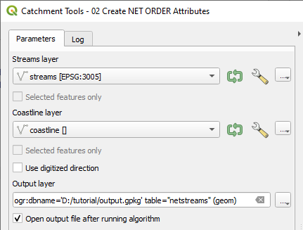
  <figcaption></figcaption>
</figure>

* check the output log for the number of unsolved streams.  This dataset has 148 and will be repaired in the following step.
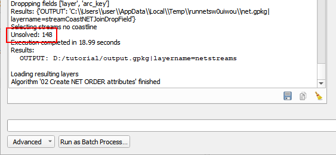

* when the algorithm finishes, a new layer called **netstreams** will appear in the Layers list. Open the attribute table by right mouse clicking on this layer and choose **Open Attribute Table** from the context menu. Inspect the table to see that the ORDER attributes are populated.  Below is a description of some of the more important fields that will be seen.

<figure>
  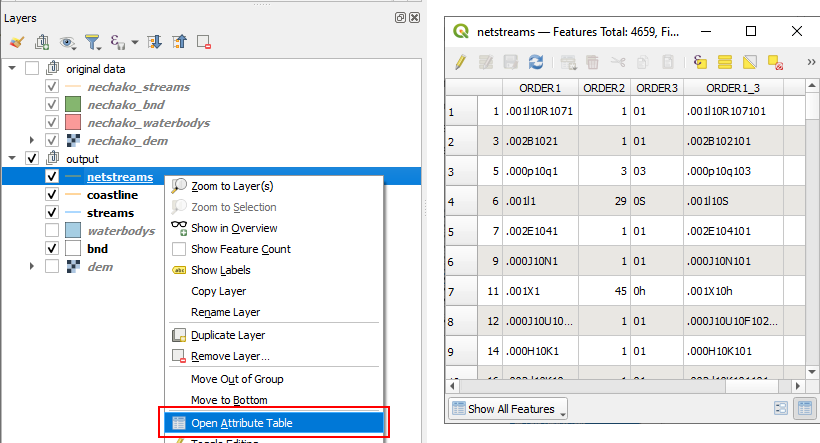
  <figcaption></figcaption>
</figure>

|Name|Description|
| :---: | :---: |
| NETTYPE | The type of feature.  1=Stream, 9999=Coastline |
| ARC | The unique id of this stream segment assigned by NET. |
| SOLVED | Indicates that the stream segment has been solved and has ORDER attributes assigned.  1 = solved, 0 = not solved. |
| BASIN | All streams connected in a group gets a unique number. |
| STRAHLER | The Strahler stream order. |
| ORDER1 | The ORDER1 field for up/downstream tracing.  This consists of a string of “base 64” characters which are used to represent the stream order in the network.  This field combined with ORDER2/ORDER3 can be used to determine what is upstream or downstream on any part of the network |
| ORDER2 | The ORDER2 field for up/downstream tracing.  This is the number equivalent of ORDER3.  This field combined with ORDER1 is used to determine what is upstream or downstream on any part of the network. |
| ORDER3 | The ORDER3 field for up/downstream tracing.   This is the “base 64“ equivalent of ORDER2.  This field combined with ORDER1 is used to determine what is upstream or downstream on any part of the network. |

**Video**

<video id="video" width="420" height="260" controls preload="metadata" crossorigin="anonymous">
  <source src="./videos/create_net_order_attributes.mp4" type="video/mp4">
</video>

Note, this video uses the drag and drop method to select layers for the algorithm input.  

</ul>

#### **3. Check for unsolved streams**
<ul>

All streams must be linked together and terminate to a coastline feature.  If the stream network contains any breaks, the streams that are upstream of the interruption will be unsolved and have no ORDER attributes.

As seen in proceeding step, there were 148 unsolved streams.  To show the unsolved streams, the **netstreams** layer will be styled on the SOLVED attribute.  Open the **netstreams** Layer Properties and select **Symbology** from the sidebar.  

* Change the symbology type to **Catergorized** from the dropdown.  See **1** in below image.
* Select the **SOLVED** field for **Value**.  See **2** in below image.
* Press the **Classify** button.  See **3** in below image.
* Change the color for value 0 to red and set the label to "unsolved". Change the color for value 1 to blue and set the label to "solved".  For **all other values**, change it to any other color than red or blue and set the label to "other".  See **4** in below image.
* Press **OK**.

* 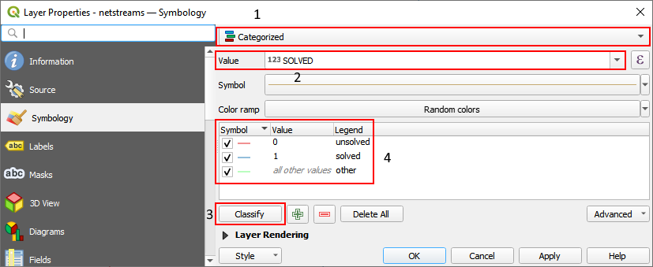

* Locate the unsolved streams by panning around until the red colored streams are visible.  In the next step, these will be repaired.

* 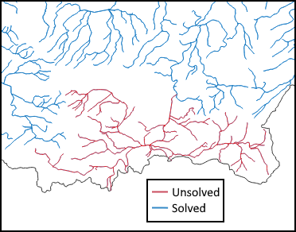

**Video**

<video id="video" width="420" height="260" controls preload="metadata" crossorigin="anonymous">
  <source src="./videos/create_net_order_attr_check_unsolved.mp4" type="video/mp4">
</video>

</ul>

#### **4. Repair unsolved streams**
<ul>

* Zoom-in to the area where the red unsolved and blue solved streams meet each other.  Keep zooming in until the gap is visible.  This will be filled by adding a line segment.

<ul>
**Video**

<video id="video" width="420" height="260" controls preload="metadata" crossorigin="anonymous">
  <source src="./videos/create_net_order_attr_zoom.mp4" type="video/mp4">
</video>
</ul>

* This step is not necessary, but it will help with visualizing the digitizing direction or flow direction.  Watch the video to see how this is done. 

<ul>
**Video**

<video id="video" width="420" height="260" controls preload="metadata" crossorigin="anonymous">
  <source src="./videos/create_net_order_attr_solved_symb.mp4" type="video/mp4">
</video>
</ul>

* Start repairing the **netstreams** layer by right mouse click on it in the Layers list and select **Toggle Editing**.  Also, this can be done by using the **Toggle Editing** button  from the toolbar.  Notice the **netstreams** layer will have a pencil symbol that indicates the layer is in edit mode.

* Next, press the **Add Line Feature** toolbar button  to start digitizing a line to repair the gap.  Also, ensure the **Digitize with Segment** option  is selected.  If not, use the down arrow button  next to the **Add Line Feature** toolbar button to select it.  

* Ensure snapping is enabled  and **netstreams** is checked as the snap layer in the snapping advanced configuration .

* 

* Start digitizing a point from the unsolved red stream end point (see below image **1**) and complete the line by adding a point to the solved blue side (see below image **2**).  End the digitizing by right-mouse clicking and the feature attributes edit dialog will appear.  Set NETTYPE to 1 and ignore all other attributes.  See below image **3**.

<ul>

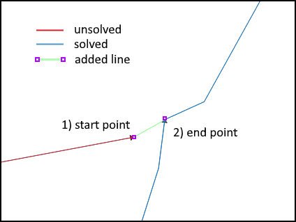

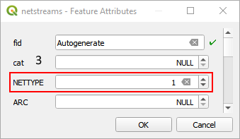

**Video**

<video id="video" width="420" height="260" controls preload="metadata" crossorigin="anonymous">
  <source src="./videos/create_net_order_attr_repair.mp4" type="video/mp4">
</video>
</ul>

* After the repair is done, run the **Create NET ORDER attributes algorithm** to recreate the ORDER attributes with the repaired **Streams** layer.
  * Select **netstreams** for **Streams layer**.
  * Select **coastline** for **Coastline layer**.
  * Ensure **Use digitized direction** is unchecked.
  * For Output layer, select **Save to GeoPackage** from the dropdown and select **tutorial_data.gpkg** and press **Save**.  An additional dialog will appear for entering the output layer name.  Enter **netstreams_repaired** and press **OK**.
  * Before pressing **Run** or while the algorithm is running, select the **output** group, so that when the output layer is generated, it's inserted at the top.
  * Press **Run**

* 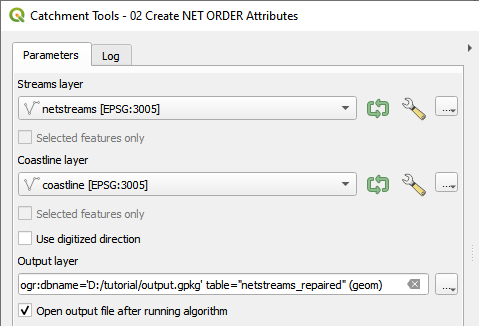

* When the algorithm is finished running, the number of unsolved streams shown in the algorithm dialog log tab output should be 0.

* 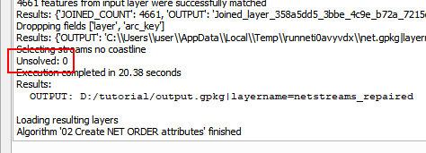

**Video**

<video id="video" width="420" height="260" controls preload="metadata" crossorigin="anonymous">
  <source src="./videos/create_net_order_attr_with_repaired.mp4" type="video/mp4">
</video>

</ul>
</ul>

### <ins>**Dissolve NET ORDER streams**</ins>
<ul>

The number of catchments that will be created can be reduced by first dissolving the stream network on NET ORDER attributes ORDER1, BASIN and STRAHLER.

From the Processing Toolbox, open the BEACONs->Catchment Tools->**03 Dissolve NET ORDER streams** algorithm.

* Select **netstreams_repaired** for **NET ORDER Streams layer**
* Use **-1** for **Max dissolved stream length**.
* For **Output dissolved streams layer**, select **Save to GeoPackage** from the dropdown and select **output.gpkg** and press **Save**.  An additional dialog will appear for entering the output layer name.  Enter **netstreams_dissolved** and press **OK**.
* Leave **Output dissolved points layer** as **Skip output** because it's not needed.
* Before pressing **Run** or while the algorithm is running, select the **output** group, so that when the output layer is generated, it's inserted at the top.
* Press **Run**

<figure>
  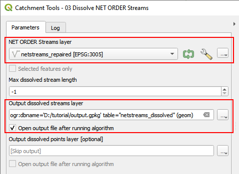
  <figcaption></figcaption>
</figure>

**Video**

<video id="video" width="420" height="260" controls preload="metadata" crossorigin="anonymous">
  <source src="./videos/dissolve_netstreams.mp4" type="video/mp4">
</video>

The left side image shows 3 streams segments (ORDER .000G109, .000G10= and .00G10A) and their corresponding catchments. The right side image shows the same stream segments after being dissolved into single segment (ORDER .000G109). The result is that a single catchment is created from it.

|no streams dissolved|dissolved streams|
|:--:|:--:|
|||
|[1]=ORDER1, [3]=ORDER3, [B]=BASIIN

Note, a segment can only merge with its neighbour segment, if it's the only neighbour segment.  In the lower left corner, .000G108 has 2 neighbour segments, so it cannot be merged with .000G109.

The NET ORDER attributes need to be regenerated after dissolving. 

* Select **netstreams_dissolved** for **Streams layer**.
* Select **coastline** for **Coastline layer**.
* Ensure **Use digitized direction** is unchecked.
* For Output layer, select **Save to GeoPackage** from the dropdown and select **tutorial_data.gpkg** and press **Save**.  An additional dialog will appear for entering the output layer name.  Enter **netstreams_final** and press **OK**.
* Before pressing **Run** or while the algorithm is running, select the **output** group, so that when the output layer is generated, it's inserted at the top.
* Press **Run**

* 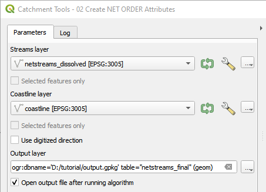

**Video**

<video id="video" width="420" height="260" controls preload="metadata" crossorigin="anonymous">
  <source src="./videos/create_net_order_attr_final.mp4" type="video/mp4">
</video>

</ul>

### <ins>**AGREE DEM Reconditioning**</ins>
<ul>

The surface elevation of the DEM will be modified to be more consistent with the mapped streams by using the AGREE DEM reconditioning procedure.  A detailed technical description of the procedure is described [here](https://www.caee.utexas.edu/prof/maidment/gishydro/ferdi/research/agree/agree.html). 

The following steps will be performed:
1) [Create digital streams from DEM.](#1-create-digital-streams-from-dem)
2) [Compare digital streams and mapped streams to determine the spatial error.](#2-compare-digital-streams-and-mapped-streams-to-determine-the-spatial-error)
3) [Calculate Smooth Drop depth parameter.](#3-calculate-smooth-drop-depth-parameter)
4) [Create AGREE Reconditioned DEM.](#4-create-agree-reconditioned-dem)

#### **1. Create digital streams from DEM**
<ul>

A set of digital streams will be created to be used for comparison against the mapped streams to determine the spatial error.  

From the Processing Toolbox, open the BEACONs->Catchment Tools->**04a GRASS r.stream.extract** algorithm.  If the dialog does not appear, check that the GRASS plugin is active. From the main menu select Plugins->Manage And Install Plugins, then ensure **GRASS GIS Processing Provider** is checked.

* Select the **dem** layer for the **Input map: elevation map parameter**.
* Leave all other parameters at the default values.
* For output **Unique strems ids (rast)** layer, select **Save to File...** from the dropdown. The **Save File dialog** will appear and ensure the output directory is correct and that **TIF files (*.tif)** is the selected **Save as type**.  Name the output **Unique stream ids (rast)** as **demstreams.tif** and then press **Save**.
* Uncheck **Open output file** for **Unique stream ids (vect)** and **Flow direction**, since these are not needed.
* Before pressing **Run** or while the algorithm is running, select the **output** group, so that when the output layer is generated, it's inserted at the top.
* Press **Run** to create the digital streams.
* 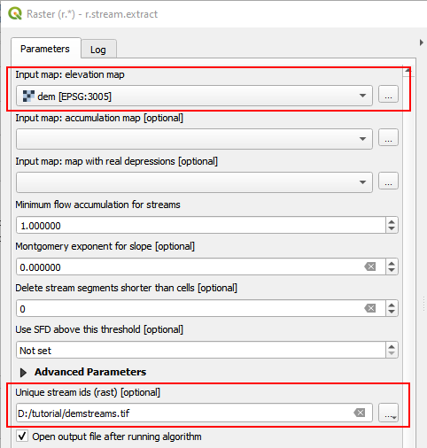

* While the algorithm is running, warnings such as the following will appear.  These can be disregarded and the algorithm will finish with the correct results.

<ul>
WARNING: Concurrent mapset locking is not supported on Windows. 
WARNING: The combination of types is not supported by all formats. 
ERROR 6: output.tif, band 1: SetColorTable() only supported for Byte or UInt16 bands in TIFF format.
</ul>

**Video**

<video id="video" width="420" height="260" controls preload="metadata" crossorigin="anonymous">
  <source src="./videos/create_digital_steams.mp4" type="video/mp4">
</video>

</ul>

#### **2. Compare digital streams and mapped streams to determine the spatial error**
<ul>

The spatial error is found by searching for the largest distance between comparable sections of digital and mapped streams.  

* First, setup the layer symbology for **netstreams_final** and **demstreams**.
  * Change **demstreams** layer raster symbology.  Right click on **demstreams** layer, select **Properties** and change  **Render type** to **Single color** under **Band Rendering**.  Then, change the color.
  * Change **netstreams_final** layer to a blue color.  
  * Move **netstreams_final** layer above **demstreams** layer.
  * Turn off all other layers except for **netstreams_final**, **demstreams** and **waterbodys**.

<ul>

**Video**

<video id="video" width="420" height="260" controls preload="metadata" crossorigin="anonymous">
  <source src="./videos/compare_streams_symb.mp4" type="video/mp4">
</video>
</ul>

* Pan and zoom around the entire dataset with both digital and mapped streams layers visible and use the **Measure Line** tool to measure the differences between the two.  Streams in waterbodies can be ignored.

* 

* This largest difference found will be used as the buffer distance in the AGREE procedure.  It is recommended that the distance be slightly bigger than what was found.  The largest error for this dataset is about 250m, so a 300m buffer will be used.

<figure>
  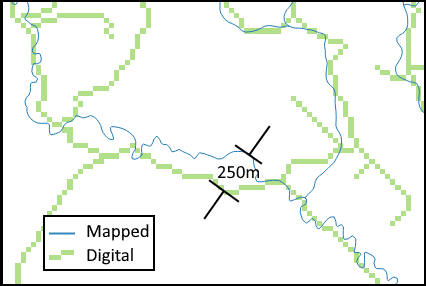
  <figcaption><i>Comparing the distance between Mapped vs. DEM streams.</i></figcaption>
</figure>

<ul>

**Video**

<video id="video" width="420" height="260" controls preload="metadata" crossorigin="anonymous">
  <source src="./videos/compare_digital_mapped_streams.mp4" type="video/mp4">
</video>
</ul>

</ul>

#### **3. Calculate Smooth Drop depth parameter**
<ul>

The smooth drop depth parameter controls how much the elevation of cells corresponding to the mapped streams are dropped.  This will be calculated by taking the average slope in the streams buffer and multiplying it by the buffer distance.

From the Processing Toolbox, open the BEACONs->Catchment Tools->**04b Calculate Smooth Drop Depth** algorithm.

* Select the **dem** layer for **DEM layer**.
* Select the **netstreams_final_** layer for **Streams layer**.
* Use **300**(m) for Buffer distance as determined in the previous step.
* Leave **Output slope in stream buffer layer** as **Skip output**, since this is not needed.
* Press **Run**.

* 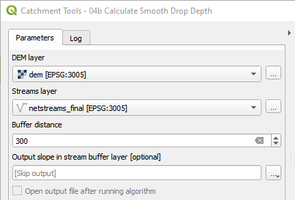

* While the algorithm is running, warnings such as the following will appear.  These can be disregarded and the algorithm will finish with the correct results.

<ul>
WARNING: Concurrent mapset locking is not supported on Windows. 
ERROR 6: ####.tif, band 1: SetColorTable() only supported for Byte or UInt16 bands in TIFF format.
</ul>

After the algorithm is finished, the calculated **Smooth Drop Depth** value will be located in the **Log** tab at the bottom of the log text.  The value here is **21.9**m or ~**22**m.

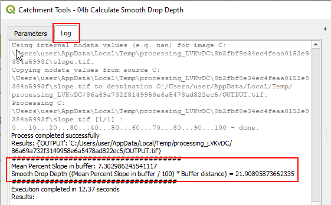

**Video**

<video id="video" width="420" height="260" controls preload="metadata" crossorigin="anonymous">
  <source src="./videos/calc_smooth_drop_depth.mp4" type="video/mp4">
</video>

</ul>

#### **4. Create AGREE Reconditioned DEM**

<ul>
From the Processing Toolbox, open the BEACONs->Catchment Tools-> **04c AGREE DEM Reconditioning** algorithm.

* Select the **dem** layer for **DEM layer**.
* Use **netstreams_final** for **Streams layer**.
* Use **-22**(m) for **Smooth drop depth** that was calculated in the previous step.  Note, a negative number must be used to lower the elevation.
* Use **300m** for **Buffer distance**.
* Use **-1000m** for **Sharp drop depth**.  Note, a negative number must be used to lower the elevation.
* For **Agree output**, select **Save to File...** from the dropdown. The **Save File** dialog will appear and ensure the output directory is correct and that **TIF files (*.tif)** is the selected **Save as type**.  Name the output **agree.tif** and then press **Save**.
* Before pressing **Run** or while the algorithm is running, select the output group, so that when the output layer is generated, it's inserted at the top.
* Press **Run**.

* 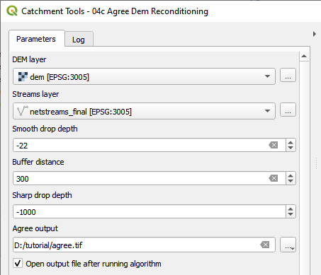

While the algorithm is running, warnings such as the following will appear.  These can be disregarded and the algorithm will finish with the correct results.  

WARNING: Concurrent mapset locking is not supported on Windows 
ERROR 6: output.tif, band 1: SetColorTable() only supported for Byte or UInt16 bands in TIFF format.

**Video**

<video id="video" width="420" height="260" controls preload="metadata" crossorigin="anonymous">
  <source src="./videos/agree_recondition_dem.mp4" type="video/mp4">
</video>

</ul>

</ul>

### <ins>**Fill Sinks**</ins>
<ul>

Sinks are cells where the elevation of all neighbouring cells are higher, which prevents water from flowing out.  These must be filled in to create a continuous surface for water to travel downstream.  There are many different algorithms that can be applied and the SAGA GIS **Fill Sinks Wang&Liu** algorithm will be used here.

From the Processing Toolbox, open the BEACONs->Catchment Tools->**05 SAGA GIS Fill Sinks Wang&Liu** algorithm.

* Select the **agree** layer for **DEM**.
* For **Filled DEM**, select **Save to File...** from the dropdown. The **Save File** dialog will appear and ensure the output directory is correct. SAGA GIS uses the SDAT raster format, so  **SDAT files (*.sdat)** must be selected for **Save as type**.    Name the output **filled.sdat** and then press **Save**.

* Uncheck output for **Flow Direction** and **Watershed Basins**, since these are not needed.
* Press **Run**.

<figure>
  
  <figcaption><i>Note, the output file name extension must be .sdat.</i></figcaption>
</figure>

**Video**

<video id="video" width="420" height="260" controls preload="metadata" crossorigin="anonymous">
  <source src="./videos/saga_gis_fill_sinks_wang_liu.mp4" type="video/mp4">
</video>
</ul>

### <ins>**Flow Direction**</ins>
<ul>

The cardinal direction of flow from one cell to the next cell will be encoded using the D8 flow direction numbering system.  This will be used in the next step to create the raster watersheds.

From the Processing Toolbox, open the BEACONs->Catchment Tools->**06 Flow Direction algorithm**

* Select **filled** for the **DEM layer**.
* Select **D8** for the **Output flow direction format**.
* For **Output flow direction layer**, select **Save to File...** from the dropdown. The **Save File** dialog will appear and ensure the output directory is correct and that **TIF files (*.tif)** is the selected **Save as type**.  Name the output **flowdir.tif** and then press **Save**.
* Press **Run**. 

<figure>
  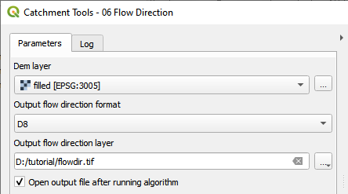
  <figcaption></figcaption>
</figure>

**Video**

<video id="video" width="420" height="260" controls preload="metadata" crossorigin="anonymous">
  <source src="./videos/flow_direction.mp4" type="video/mp4">
</video>
</ul>

### <ins>**Watershed**</ins>
<ul>

Using the flow direction and NET ORDER streams, the raster watersheds will be created from these layers.  The flow direction is used to trace the cell to cell water flow in a watershed.  The ARC attribute id of the watershed stream will be assigned to its contributing watershed cells.

From the Processing Toolbox, open the BEACONs->Catchment Tools->**07 Watershed** algorithm.

* Select **flow direction** for the **Flow Direction layer**
* Select **D8** for the **Output flow direction format**
* Select **netstreams_final** for the **NET ORDER Streams layer**
* Name the **Output watershed layer** file as **watersheds.tif**
* Press **Run**. 

<figure>
  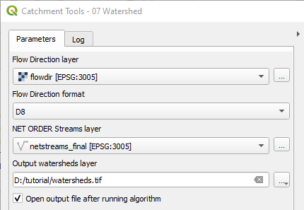
  <figcaption></figcaption>
</figure>

**Video**

<video id="video" width="420" height="260" controls preload="metadata" crossorigin="anonymous">
  <source src="./videos/watershed.mp4" type="video/mp4">
</video>
</ul>

### <ins>**Create NET ORDER Catchments**</ins>
<ul>

Create vector catchments from raster watersheds and join all stream NET ORDER attributes.

From the Processing Toolbox, open the BEACONs->Catchment Tools->**08 Create NET ORDER Catchments** algorithm.

* Select **watershed** for the **Watershed raster layer**
* Select **netstreams_final** for the **NET ORDER streams layer**
* For **Output catchments layer**, select **Save to GeoPackage** from the dropdown and select **tutorial_data.gpkg** and press **Save**. An additional dialog will appear for entering the output layer name. Enter **catchments** and press OK.
* Press **Run**. 

<figure>
  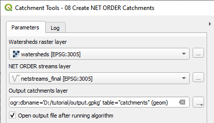
  <figcaption></figcaption>
</figure>

**Video**

<video id="video" width="420" height="260" controls preload="metadata" crossorigin="anonymous">
  <source src="./videos/create_net_catchments.mp4" type="video/mp4">
</video>
</ul>

### <ins>**Eliminate Artifact Catchments**</ins>
<ul>

Certain types of artifacts need to be eliminated to create a clean dataset.  

The following steps will be performed:

1) [Eliminate multi-catchments](#1-eliminate-multi-catchments)
2) [Eliminate single catchments](#2-eliminate-single-catchments)
3) [Eliminate full catchments(not implemented yet)](#2-eliminate-full-catchments)

#### **1. Eliminate multi-catchments**
<ul>

From the Processing Toolbox, open the BEACONs->Catchment Tools->**09 Eliminate Artifact Catchments** algorithm.

* Select **catchments** for **Catchment layer**
* Select **netstreams_final** for the **Net order streams layer**
* Select the **dem** layer for **DEM layer**.
* Select **MULTI** for **Catchment elimination type** as **catch_elim_multi**
* Ensure **Must contains no streams** and **Multiple passes** are checked
* Name the **Output eliminate catchment layer**
* Press **Run**.

<figure>
  
  <figcaption></figcaption>
</figure>
</ul>

#### **2. Eliminate single catchments**
<ul>

From the Processing Toolbox, open the BEACONs->Catchment Tools->**09 Eliminate Artifact Catchments** algorithm.

* Select **catchments** for **Catchment layer**
* Select **netstreams_final** for the **Net order streams layer**
* Select the **dem** layer for **DEM layer**.
* Select **SINGLE** for **Catchment elimination type** as **catch_elim_single**
* Ensure **Must contains no streams** and **Multiple passes** are checked
* Name the **Output eliminate catchment layer**
* Press **Run**. 

<figure>
  
  <figcaption></figcaption>
</figure>

</ul>
</ul>

### <ins>**Identify Downstream Catchment Breaks**</ins>
<ul>

Identify Downstream Catchment Breaks

From the Processing Toolbox, open the BEACONs->Catchment Tools->**10 Identify Downstream Catchment Breaks** algorithm.

* Press **Run**. 

<figure>
  
  <figcaption></figcaption>
</figure>
</ul>

### <ins>**Repair Downstream Catchment Breaks**</ins>
<ul>

Repair Downstream Catchment Breaks

From the Processing Toolbox, open the BEACONs->Catchment Tools->**11 Repair Downstream Catchment Breaks** algorithm.

* Press **Run**. 

<figure>
  
  <figcaption></figcaption>
</figure>
</ul>

### <ins>**Add Catchment Attributes**</ins>
<ul>

Repair Downstream Catchment Breaks

From the Processing Toolbox, open the BEACONs->Catchment Tools->**12 Add Catchment Attributes** algorithm.

* Select **catchments** for **Catchment layer**
* Select **CATCHNUM** for **Catchment Num Field**
* Press **Run**. 

<figure>
  
  <figcaption></figcaption>
</figure>
</ul>

### <ins>**Add Catchment Areas**</ins>
<ul>

Add land and water area fields to catchments layer.

From the Processing Toolbox, open the BEACONs->Catchment Tools->**13 Add Catchment Areas** algorithm.

* Select **catchments** for **Catchment layer**
* Select **CATCHNUM** for **Catchment Num Field**
* Select **waterbodys** for **Waterbodys layer**
* Press **Run**. 

<figure>
  
  <figcaption></figcaption>
</figure>
</ul>

### <ins>**Create Benchmark Builder Input**</ins>
<ul>

Create Benchmark Builder Input

From the Processing Toolbox, open the BEACONs->Catchment Tools->**14 Create Benchmark Builder Input** algorithm.

* Select **catchments** for **Catchment layer**
* Select **CATCHNUM** for **Catchment Num Field**
* Select **Output Folder**  
* Press **Run**. 

<figure>
  
  <figcaption></figcaption>
</figure>

</ul>

### <ins>**Testing Benchmark Builder Input**</ins>
<ul>

The input files are tested by running the Benchmark Builder program to check that all catchments are connected upstream and downstream.

<figure>
  
  <figcaption></figcaption>
</figure>

</ul>

<s>
* , but this time it can be executed from the processing history.  To do this, press the **Processing Toolbox History** button  (see below image **1**) and the **Processing History** dialog will appear with a list of previously executed algorithms.  From the list, select the most recent run of the **Create NET ORDER attributes** algorithm. See below image **2**. Since the streams and coastline input parameters are the same,  only the output file name needs to be changed.  Name the file **netstreams_repaired**.
* 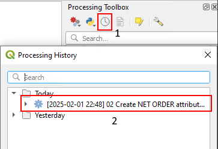
</s>

**Video**

<video id="video" width="420" height="260" controls preload="metadata" crossorigin="anonymous">
  <source src="./videos/create_net_order_attr_with_repaired.mp4" type="video/mp4">
</video>
